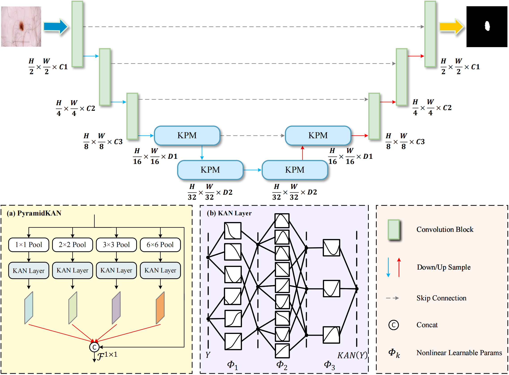
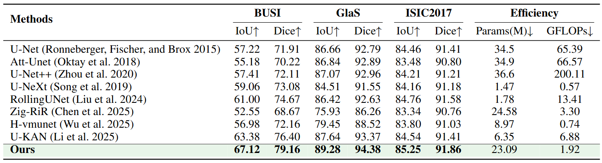

# KCNet

## 0. Abstract

With the widespread adoption of the Kolmogorov-Arnold Network (KAN) framework in computer vision, KAN-based models have achieved significant progress in medical image segmentation. However, these models do not always outperform CNN-based or Mamba-based models. This limitation mainly stems from the fact that although most existing KAN-based studies have effectively improved the nonlinear modeling capabilities of the model using KAN, they have ignored multi-scale feature extraction. Secondly, clustering is ubiquitous in medical images, and traditional pixel-level losses (such as BCE and Dice) focus solely on the classification accuracy of individual pixels, lacking a measure of the overall connectivity of clustered structures. This results in poor performance for clustered lesions. To address these challenges, we propose a new framework named KCNet, which integrates Tok-KAN and PyramidKAN. This design leverages the nonlinear modeling capabilities and interpretability of KAN networks and helps capture multi-scale features. Furthermore, we propose a cluster-sensitive distance loss function, which, by introducing a distance metric, better preserves the integrity and connectivity of lesion clusters. Comprehensive experiments on three public benchmark datasets, BUSI, GlaS, and ISIC2017, demonstrate that our method consistently outperforms state-of-the-art methods across multiple evaluation metrics, demonstrating its robustness and effectiveness in addressing key segmentation challenges. For reproducibility, please refer to the implementation code at: https://github.com/Anonymous2025-cv/KCNet.


## 1. Overview

<div align="center">

</div>


## 2. Main Environments

You can follow the [U-KAN](https://github.com/Zhaoyi-Yan/U-KAN) and [UltraLight-VM-UNet](https://github.com/wurenkai/UltraLight-VM-UNet) installation instructions, or follow the steps below (Python 3.8):

```
conda create -n KCNet python=3.8
conda activate KCNet
pip install torch==1.13.0 torchvision==0.14.0 torchaudio==0.13.0 
pip install packaging
pip install timm==0.4.12
pip install pytest chardet yacs termcolor
pip install submitit tensorboardX
pip install triton==2.0.0
pip install causal_conv1d==1.0.0  
pip install mamba_ssm==1.0.1
pip install scikit-learn matplotlib thop h5py SimpleITK scikit-image medpy yacs
pip install addict dataclasses pandas pyyaml albumentations tqdm tensorboardX numpy opencv-python
pip install perceptual pillow scipy tifffile typing-extensions yapf
```


## 3. Datasets

BUSI: The dataset can be found [here](https://www.kaggle.com/datasets/aryashah2k/breast-ultrasound-images-dataset) .

Glas: The dataset can be found [here](https://websignon.warwick.ac.uk/origin/slogin?shire=https%3A%2F%2Fwarwick.ac.uk%2Fsitebuilder2%2Fshire-read&providerId=urn%3Awarwick.ac.uk%3Asitebuilder2%3Aread%3Aservice&target=https%3A%2F%2Fwarwick.ac.uk%2Ffac%2Fcross_fac%2Ftia%2Fdata%2Fglascontest&status=notloggedin) .

ISIC2017: The dataset can be found [here](https://challenge.isic-archive.com/data/) .


## 4. Train the KCNet

```
python train.py --arch KCNet --dataset {dataset} --input_w {input_size} --input_h {input_size} --name {dataset}_KCNet  --data_dir [YOUR_DATA_DIR]
```


## 5. Test the KCNet 

```
python val.py --name ${dataset}_KCNet --output_dir [YOUR_OUTPUT_DIR] 
```


## 6. Comparison With State of the Arts

The performance of the proposed method is compared with the state-of-the-art models on the BUSI, GlaS, and ISIC2017 datasets, where the best results are shown in bold.

<div align="center">

</div>


## 7. Acknowledgement

Thanks to [U-KAN](https://github.com/Zhaoyi-Yan/U-KAN) and [UltraLight-VM-UNet](https://github.com/wurenkai/UltraLight-VM-UNet) for their outstanding works.
