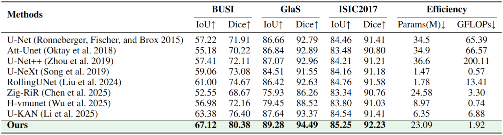

# PyramidKAN-Net

## 0. Abstract

Accurate and efficient medical image segmentation is crucial in clinical tasks such as disease diagnosis and treatment planning. In recent years, deep learning technology has significantly promoted the development of segmentation with its powerful feature extraction capabilities. However, most existing methods still face the following challenges: medical image lesions vary in size, which usually leads to insufficient multi-scale feature extraction capabilities; it is difficult to achieve efficient modeling when dealing with clustered lesions with complex structures or clustered distributions, resulting in insufficient model attention to clustered lesions, thus affecting segmentation performance and efficiency. To address these challenges, we propose a new framework called PyramidKan-Net, which combines an enhanced pyramid fusion module with a cluster-sensitive distance (CSD) loss function. This design makes full use of the nonlinear modeling capabilities and interpretability of the KAN network, so that the network can capture multi-scale features in combination with contextual information with minimal computational overhead. In addition, the proposed cluster-sensitive distance loss function introduces a structural distance penalty of "intra-class compactness and inter-class separation" to more effectively guide the model to learn coherent, complete, and well-defined segmentation results. While maintaining the overall segmentation performance, it improves the detection and segmentation of small lesion clusters or edge structures, thereby improving the segmentation performance of the model. Comprehensive experiments on three public benchmark datasets, BUSI, GlaS, and ISIC2017, show that our method consistently outperforms the state-of-the-art methods in multiple evaluation indicators, demonstrating its robustness and effectiveness in solving key segmentation challenges. If you need to reproduce, you can visit the following link to view the implementation code: https://github.com/Anonymous2025-cv/PyramidKAN-Net.


## 1. Overview

<div align="center">

</div>


## 2. Main Environments

The environment installation process can be carried out as follows:

```
conda create -n MED-Net python=3.8
conda activate MED-Net
pip install torch==1.13.0 torchvision==0.14.0 torchaudio==0.13.0 
pip install packaging
pip install timm==0.4.12
pip install pytest chardet yacs termcolor
pip install submitit tensorboardX
pip install triton==2.0.0
pip install causal_conv1d==1.0.0  
pip install mamba_ssm==1.0.1
pip install scikit-learn matplotlib thop h5py SimpleITK scikit-image medpy yacs
pip install addict dataclasses pandas pyyaml albumentations tqdm tensorboardX numpy opencv-python
pip install perceptual pillow scipy tifffile typing-extensions yapf
```


## 3. Datasets

BUSI: The dataset can be found [here](https://www.kaggle.com/datasets/aryashah2k/breast-ultrasound-images-dataset) .

Glas: The dataset can be found [here](https://websignon.warwick.ac.uk/origin/slogin?shire=https%3A%2F%2Fwarwick.ac.uk%2Fsitebuilder2%2Fshire-read&providerId=urn%3Awarwick.ac.uk%3Asitebuilder2%3Aread%3Aservice&target=https%3A%2F%2Fwarwick.ac.uk%2Ffac%2Fcross_fac%2Ftia%2Fdata%2Fglascontest&status=notloggedin) .

ISIC2017: The dataset can be found [here](https://challenge.isic-archive.com/data/) .


## 4. Train the PyramidKAN-Net

```
python train.py --arch UKAN --dataset {dataset} --input_w {input_size} --input_h {input_size} --name {dataset}_UKAN  --data_dir [YOUR_DATA_DIR]
```


## 5. Test the PyramidKAN-Net 

```
python val.py --name ${dataset}_UKAN --output_dir [YOUR_OUTPUT_DIR] 
```


## 6. Comparison With State of the Arts

The performance of the proposed method is compared with the state-of-the-art models on the BUSI, GlaS, and ISIC2017 datasets, where the best results are shown in bold.

<div align="center">

</div>


## 7. Acknowledgement

Thanks to [U-KAN](https://github.com/Zhaoyi-Yan/U-KAN) and [PSPNet](https://github.com/hszhao/PSPNet) for their outstanding works.
